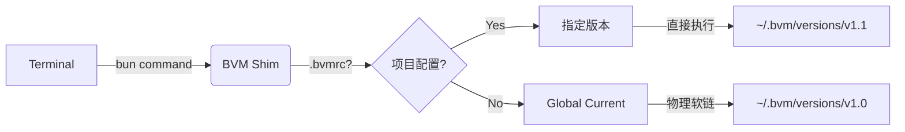

# 0ms 延迟！我写了一个专属于 Bun 的原生版本管理器 BVM

> **摘要**：在构建 AI Agent 技术栈时，为了追求极致的冷启动速度，我选择了基于 JavaScriptCore 的 Bun。但为了解决由此带来的环境隔离与版本管理难题，我手写了 BVM——一个拥有 0ms 启动延迟、原子级隔离架构、并专为国内优化的原生版本管理器。

大家好，我是 廖磊 AI 编程。

在构建 **AI Agent** 的技术栈时，**Bun** 凭借其基于 **JavaScriptCore (JSC)** 的极速冷启动能力，正逐渐成为 Node.js 的强力替代者。对于需要频繁启动短生命周期任务的 Agent 而言，Bun 的毫秒级响应是不可抗拒的诱惑。

然而，在实际工程化落地的过程中，我发现引入 Bun 往往意味着破坏现有的 Node.js 开发环境。
官方推荐的 `curl | bash` 安装方式简单粗暴，缺乏版本控制；而市面上的通用管理器（如 asdf, mise）虽然支持 Bun，但往往伴随着复杂的配置或显著的 Shell 启动延迟。

作为一名追求极致工程化的开发者，我深入研究了现有的方案，决定“用 Bun 解决 Bun 的问题”。我手写了 **BVM (Bun Version Manager)**——一个专为 Bun 生态打造的、原生、极速的版本管理工具。

---

## 1. 致敬习惯：无缝迁移的体验

造轮子的第一原则：**不要改变用户习惯。**

虽然是为了解决 AI Agent 的环境问题，但我希望 BVM 对所有 Node.js 开发者都足够友好。BVM 完美复刻了 `nvm` 的核心命令集。

*   **安装版本**：`bvm install latest` 或 `bvm install 1.0.9`
*   **切换版本**：`bvm use 1.0.9`
*   **查看列表**：`bvm ls`
*   **设置默认**：`bvm alias default 1.0.9`

没有学习成本，肌肉记忆直接复用。

同时，针对团队协作，BVM 支持 **项目级自动切换**。如果你的 Agent 项目根目录下有一个 `.bvmrc` 文件：

```bash
echo "1.0.9" > .bvmrc
```

当你进入这个目录运行 `bun` 命令时，BVM 会**自动检测并切换**到对应版本。你甚至不需要手动输入 `bvm use`，一切都在毫秒间自动发生。

---

## 2. 挑战物理极限：如何做到 0ms 延迟？

很多版本管理器之所以慢，是因为它们在你的 Shell 配置文件（`.zshrc` / `.bashrc`）里注入了大量的初始化脚本。每次打开终端，它们都要运行一遍，导致终端启动“卡顿”。对于追求效率的极客来说，这几百毫秒的延迟是不可接受的。

**BVM 拒绝这样做。**

我设计了一套 **Symlink-Shim 混合架构**。



当你执行 `bvm use` 时，BVM 会直接在文件系统层面修改一个物理软链接 (`~/.bvm/current`)。你的 `PATH` 永远只指向这个静态链接。

这意味着，当你打开新终端时，操作系统**不需要执行任何 BVM 代码**，直接就能找到 `bun`。
**0ms 延迟。** Bun 是极速的，管理它的工具也必须是。

---

### 3. 架构悖论：用 Bun 管理 Bun？

这是一个有趣的“鸡生蛋”问题：*如果 BVM 是用 Bun 写的，那我用 BVM 卸载了当前系统的 Bun，BVM 自己岂不是当场崩溃？*

为了解决这个问题，我引入了 **Bunker (地堡) 机制**。

BVM 在安装时，会在 `~/.bvm/runtime` 这个隐蔽的角落，下载并维护一个**完全隔离、私有的微型 Bun 运行时**。

*   **用户空间**：你平时用的 Bun，随便装、随便删，都在 `~/.bvm/versions` 下。
*   **管理空间**：BVM 靠“地堡”运行，稳如磐石。

即使你把系统搞得一团糟，BVM 依然坚挺，随时帮你一键修复环境。此外，这种架构还实现了**原子级环境隔离**：不同版本的全局包（`bun install -g`）被严格隔离在各自的版本目录下，彻底告别依赖冲突。

---

### 4. 给国内开发者的“情书”：告别下载失败

国内网络环境下，GitHub Releases 的下载速度往往只有几 KB，甚至直接超时。这对于试图尝鲜 Bun 的开发者来说是巨大的门槛。

为了解决这个问题，我在 BVM 的发布架构上设计了一套 **CDN 分流体系**：

1.  **源代码**：通过 **jsDelivr** 全球边缘节点分发。
2.  **二进制**：直接从 **NPM 官方源** (Fastly) 拉取。
3.  **智能兜底**：自动检测网络，如果 NPM 慢，自动切换到 **npmmirror 镜像**。

**结果就是：**
你不需要配置任何镜像源，不需要挂梯子。一条命令下去，进度条直接跑满带宽。

---

### 5. Windows 开发者的福音：全力拥抱 Git Bash

Windows 开发者的痛，我们懂。PowerShell 的 ExecutionPolicy 权限地狱？编码问题？Profile 加载失败？

BVM 在 Windows 上做了一个大胆的决定：**全力拥抱 Git Bash**。

我们放弃了与 PowerShell 权限系统的无尽斗争，转而通过原生的 `.sh` 脚本支持，让 Windows 用户在 **Git Bash** 中获得与 Mac/Linux **完全一致** 的 Unix 体验。

*   没有权限弹窗。
*   没有复杂的策略配置。
*   只有纯粹的 `curl | bash`。

---

### 6. 试一试？

BVM 现已发布 **v1.0.9 正式版**，修复了早期版本的所有已知问题，欢迎大家试用。

项目完全开源（MIT 协议），代码非常干净。如果你想看看如何用 TypeScript 写一个高性能 CLI，或者想了解 GitHub Actions 自动化发布的最佳实践，欢迎来 GitHub 踩踩。

**一键安装（全平台通用）：**

支持 macOS / Linux / WSL / Windows (Git Bash)

```bash
curl -fsSL https://cdn.jsdelivr.net/gh/EricLLLLLL/bvm@main/install.sh | bash
```

**项目地址：**
[https://github.com/EricLLLLLL/bvm](https://github.com/EricLLLLLL/bvm)

如果这个小工具帮你的开发体验提升了一点点，请别忘了给个 Star ⭐️！