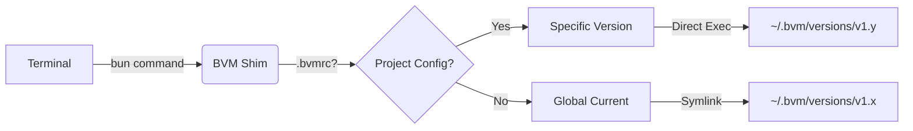

<div align="center">
  <h1>BVM</h1>
  <h3>The Native Bun Version Manager</h3>
  <p>
    Zero Latency · Atomic Isolation · Self-Healing
  </p>

  [](https://github.com/EricLLLLLL/bvm/releases)
  [](#)
  [](#)
  [](#)
  <br/>
  <a href="./README.zh-CN.md">🇨🇳 中文文档</a>
</div>

<details>
  <summary><strong>Table of Contents</strong></summary>

- [Why BVM?](#-why-bvm)
- [How It Works](#-how-it-works)
- [Benchmark](#-benchmark)
- [Installation](#-installation)
- [Quick Start](#-quick-start)
- [Project Configuration (.bvmrc)](#-project-configuration-bvmrc)
- [Migration Guide](#-coming-from-nvm-or-fnm)
- [License](#-license)

</details>

<br/>

**BVM** is the definitive version manager for Bun. **Think of it as `nvm` or `fnm`, but designed specifically for the Bun ecosystem.**

Designed for developers who refuse to wait, it leverages the Bun runtime itself to deliver an installation and management experience that is physically limited only by your network speed.

Unlike legacy tools that slow down your terminal startup or rely on heavy binary proxies, BVM uses OS-native mechanisms to achieve **0ms shell latency**.

---

## 🧩 How It Works

BVM employs a **Symlink-Shim Hybrid Architecture** to achieve zero-latency performance while maintaining perfect isolation.



1.  **Global Symlink**: `bvm use` updates a physical symlink at `~/.bvm/current`. Your shell's `PATH` points here.
2.  **Smart Shim**: When you run `bun`, BVM's lightweight shim intercepts the call **only if needed** (e.g., to respect `.bvmrc`), otherwise it yields directly to the native binary.
3.  **Dependency Injection**: BVM injects `BUN_INSTALL` environment variables dynamically, ensuring global packages installed in v1.0 don't leak into v1.1.

---

## 🌟 Why BVM?

### 🚀 Zero-Latency Shell (0ms)
Stop waiting for your terminal to load. BVM uses **Shim Architecture** and **Physical Symlinks**. Whether you are opening a new tab or switching projects, `bun` is instantly available without the "Shell Tax" of tools like `nvm`.

### 🛡️ "Bunker" Architecture
BVM is **unbreakable**. It maintains its own private, isolated Bun runtime. You can delete every installed version on your machine, or even mess up your system paths, and BVM will still work to repair your environment.

### ⚡ Blazing Fast Downloads (Global CDN)
We don't rely on flaky GitHub Releases. BVM and its managed Bun binaries are delivered via high-performance CDNs.
*   **Source Code**: Delivered via **jsDelivr** (Global Edge Network).
*   **Bun Binaries**: Downloaded directly from **NPM** (via Fastly/Cloudflare).
*   **Smart Mirroring**: Bun binaries are downloaded directly from official **NPM** distributions. BVM intelligently selects the fastest regional mirror (e.g., `npmmirror`) based on your network environment. Zero config, maximum speed worldwide.

### 📦 Atomic Environment Isolation
Switching versions shouldn't break your global tools. BVM injects `BUN_INSTALL` per version.
*   Bun `v1.0.0` global packages stay in `v1.0.0`.
*   Bun `v1.1.0` global packages stay in `v1.1.0`.
*   No more "Ghost Conflicts" or broken CLIs.

### 🪟 First-Class Windows Support
Not an afterthought. BVM is built natively for PowerShell, offering the exact same feature set and speed on Windows as on macOS and Linux.

---

## ⚡ Benchmark

| Metric | **BVM** (This tool) | **fnm / bum** (Rust) | **nvm** (Node) |
| :--- | :--- | :--- | :--- |
| **Command Overhead** | **~19ms** ⚡️ | ~28ms | >200ms |
| **Shell Startup Lag** | **0ms** 🟢 | 0ms | ~500ms 🔴 |
| **Download Speed** | **Global CDN + Auto-Mirror** 🟢 | GitHub (Slow) 🔴 | Slow / Manual Mirror |
| **Runtime Overhead** | **Zero** (Native Symlinks) | Low (Binary Proxy) | Zero |
| **Windows Support** | **Native** | Native | Wrapper needed |

> **Global Availability**: BVM automatically switches between the global NPM registry and regional mirrors (e.g., `npmmirror` for CN) to ensure max speed everywhere. No manual config required.

---

## 📥 Installation

### macOS / Linux / WSL
```bash
curl -fsSL https://cdn.jsdelivr.net/gh/EricLLLLLL/bvm@main/install.sh | bash
```

### Windows
BVM natively supports both PowerShell and Git Bash on Windows.

**PowerShell (Recommended Native):**
```powershell
irm https://cdn.jsdelivr.net/gh/EricLLLLLL/bvm@main/install.ps1 | iex
```

**Git Bash:**
```bash
curl -fsSL https://cdn.jsdelivr.net/gh/EricLLLLLL/bvm@main/install.sh | bash
```

### Install Specific BVM Version
You can install a specific version of BVM by pointing to its Git tag:

```bash
# macOS / Linux / Git Bash
curl -fsSL https://cdn.jsdelivr.net/gh/EricLLLLLL/bvm@v1.0.0/install.sh | bash

# Windows (PowerShell)
$BVM_INSTALL_VERSION="v1.0.0"; irm https://cdn.jsdelivr.net/gh/EricLLLLLL/bvm@main/install.ps1 | iex
```

---

## 🎮 Quick Start

**Install the latest version**
```bash
bvm install latest
```

**Switch to a specific version**
```bash
bvm use 1.0.4
```

**Install a specific version**
```bash
bvm install 1.0.4
```

**List all versions**
```bash
bvm ls          # Local
bvm ls-remote   # Available online
```

**Set a default for new terminals**
```bash
bvm default 1.0.4
```

**Upgrade BVM itself**
```bash
bvm upgrade
```

---

## 📁 Project Configuration (.bvmrc)

BVM supports automatic version switching per project, making it ideal for team collaboration.

1.  **Create a config file** in your project root:
    ```bash
    echo "1.0.4" > .bvmrc
    ```
2.  **Just run Bun**:
    BVM automatically detects the `.bvmrc` file when you run any `bun` command inside that directory.
    ```bash
    cd my-project
    bun -v
    # 1.0.4 (Automatically resolved from .bvmrc)
    ```

    *No manual `bvm use` required.*

---

## 🔄 Coming from `nvm` or `fnm`?

If you are used to Node Version Manager (nvm), you will feel right at home. BVM supports the same core workflow but is significantly faster and **globally optimized**.

Unlike `nvm`, which often requires manual mirror configuration (`NVM_NODEJS_ORG_MIRROR`) to work fast in some regions, BVM **automatically** selects the fastest registry (NPM Global or Aliyun Mirror) for you. It just works, everywhere.

| Task | **nvm** (Node) | **BVM** (Bun) |
| :--- | :--- | :--- |
| Install Version | `nvm install 20` | `bvm install latest` |
| Switch Version | `nvm use 20` | `bvm use latest` |
| Set Default | `nvm alias default 20` | `bvm default latest` |
| List Versions | `nvm ls` | `bvm ls` |

---

## 📄 License

MIT © [EricLLLLLL](https://github.com/EricLLLLLL)
