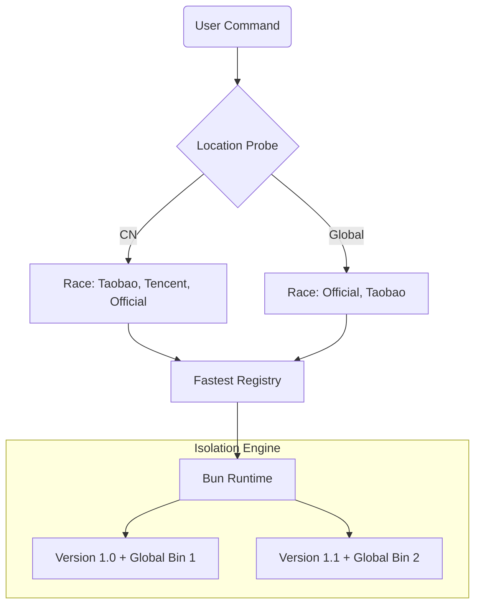

<div align="center">
  <h1>BVM</h1>
  <h3>The Definitive, High-Performance Bun Version Manager</h3>
  <p>
    0ms Startup · Smart Registry Racing · Atomic Isolation · Self-Healing
  </p>

  [](https://github.com/EricLLLLLL/bvm/releases)
  [](#)
  [](#)
  <br/>
  <a href="./README.zh-CN.md">🇨🇳 中文文档</a>
</div>

<br/>

**BVM** is a native Bun version manager designed for performance and reliability. It doesn't just manage versions; it orchestrates your entire Bun environment with surgical precision.

By leveraging **Physical Symlinks (Junctions on Windows)** and a **Smart Shim Architecture**, BVM achieves **0ms shell startup latency** while providing environment isolation that other tools simply can't match.

---

## ⚡ The Competitive Edge (Comparison)

| Feature | **BVM** (Bun Native) | **nvm** (Shell) | **bum / fnm** (Rust) |
| :--- | :--- | :--- | :--- |
| **Shell Startup Lag** | **0ms** 🟢 | ~500ms 🔴 | 0ms |
| **Command Overhead** | **~19ms** (Direct) | >200ms 🔴 | ~28ms |
| **Download Tech** | **Smart Racing (NPM Mirrors)** ⚡️ | Manual Mirrors | GitHub Releases (Unstable) |
| **Env Isolation** | **Atomic (`BUN_INSTALL`)** 🔒 | Shared Global | Shared Global |
| **Self-Healing** | **MD5 Fingerprints** 🛡️ | No | No |
| **Dependencies** | **Zero** (Native Bun) | Shell/Node | None |

> **Why BVM?** While `nvm` slows down your shell and `bum` relies on unstable GitHub downloads, BVM uses a **Race Strategy** to find the fastest NPM mirror (e.g., Aliyun, Tencent) and installs Bun in **Atomic Isolation**, ensuring your global packages never conflict between versions.

---

## 🚀 Core Features & Code Efficacy

### 🏁 Smart Registry Racing
BVM doesn't guess which mirror is fastest. It **races** them.
- **How it works**: BVM probes your location (via Cloudflare Trace) and concurrently pings official and regional mirrors (Taobao, Tencent).
- **Efficacy**: You always get the absolute maximum download speed your network allows, with zero configuration.

### 🔒 Atomic Environment Isolation
Switching Bun versions should be safe.
- **How it works**: BVM dynamically injects a unique `BUN_INSTALL` path for every version.
- **Efficacy**: Global packages installed in `v1.0` stay in `v1.0`. They won't leak into or break your `v1.1` environment.

### 🛡️ Smart Upgrade & Self-Healing
BVM is built to last.
- **How it works**: Using **MD5 Fingerprinting**, `bvm upgrade` only downloads components that have changed. After upgrading, it automatically triggers a silent **Self-Healing** routine to refresh all local shims and wrappers.
- **Efficacy**: Minimal network usage and a guaranteed consistent environment after every update.

---

## 📥 Installation

### macOS / Linux / WSL
```bash
curl -fsSL https://cdn.jsdelivr.net/gh/EricLLLLLL/bvm@main/install.sh | bash
```

### Windows (Native PowerShell)
BVM offers first-class Windows support, compatible with **PowerShell 5.1** and **PowerShell Core**.
```powershell
irm https://cdn.jsdelivr.net/gh/EricLLLLLL/bvm@main/install.ps1 | iex
```

---

## 🧩 Architecture



---

## 🎮 Quick Start

```bash
# Install & Switch
bvm install latest
bvm use 1.1.0

# Project Level (.bvmrc)
echo "1.0.30" > .bvmrc
bun -v # Automatically uses 1.0.30

# Maintenance
bvm upgrade
bvm doctor
```

---

## 📄 License

MIT © [EricLLLLLL](https://github.com/EricLLLLLL)