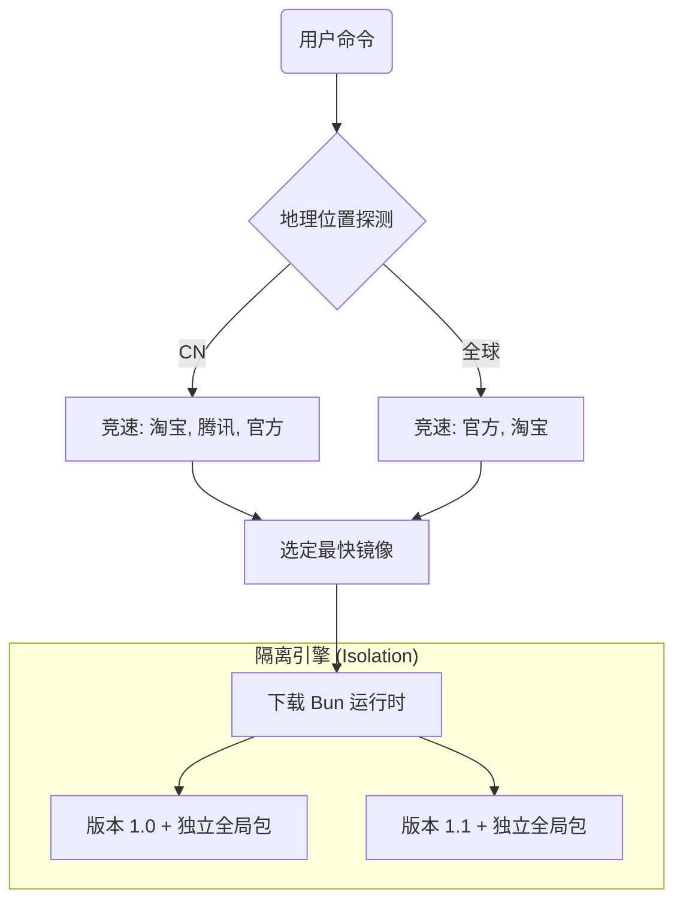

<div align="center">
  <h1>BVM</h1>
  <h3>极致性能的 Bun 原生版本管理器</h3>
  <p>
    0ms 启动 · 智能镜像竞速 · 原子化隔离 · 故障自愈
  </p>

  [](https://github.com/EricLLLLLL/bvm/releases)
  [](#)
  [](#)
  <br/>
  <a href="./README.md">🇺🇸 English Docs</a>
</div>

<br/>

**BVM** 是为 Bun 开发者量身定制的原生版本管理器。它不仅是管理版本，更是以手术刀般的精度编排你的 Bun 开发环境。

通过 **物理软链接 (Windows Junction)** 与 **智能 Shim 架构**，BVM 实现了 **0ms 的 Shell 启动延迟**，同时提供了传统工具无法企及的环境隔离性。

---

## ⚡ 架构级降维打击 (技术对比)

| 特性 | **BVM** (Bun 原生) | **nvm** (Shell 脚本) | **bum / fnm** (Rust) |
| :--- | :--- | :--- | :--- |
| **Shell 启动延迟** | **0ms** 🟢 | ~500ms 🔴 | 0ms |
| **命令执行开销** | **~19ms** (原生速度) | >200ms 🔴 | ~28ms |
| **下载技术** | **智能竞速 (NPM 镜像)** ⚡️ | 手动镜像配置 | GitHub Releases (国内极慢) |
| **环境隔离** | **原子化 (`BUN_INSTALL`)** 🔒 | 共享全局环境 | 共享全局环境 |
| **故障自愈** | **MD5 指纹校验** 🛡️ | 无 | 无 |
| **依赖程度** | **零依赖** (内置 Bun) | Shell/Node | 无 |

> **为什么选择 BVM?** 传统的 `nvm` 会拖慢你的终端启动，而 `bum` 等工具依赖极其不稳定的 GitHub 下载。BVM 通过 **实时竞速策略** 自动寻找最快的 NPM 镜像（如淘宝、腾讯），并在 **原子化隔离** 环境中安装 Bun，确保你的全局包在不同版本间永不冲突。

---

## 🚀 核心特性与代码功效

### 🏁 智能镜像竞速 (Race Strategy)
BVM 从不“猜测”哪个镜像最快，它让镜像**自己赛跑**。
- **工作原理**: BVM 自动探测地理位置（基于 Cloudflare Trace），并并发请求官方源、淘宝源、腾讯源。
- **实际功效**: 无论你身在何处，无需任何配置，你永远能以当前网络允许的最高速度下载 Bun。

### 🔒 原子化环境隔离
切换 Bun 版本不应带有副作用。
- **工作原理**: BVM 为每个安装的版本动态注入唯一的 `BUN_INSTALL` 路径。
- **实际功效**: 在 `v1.0` 下安装的全局包只留在 `v1.0`。它们不会泄漏到 `v1.1` 中，彻底杜绝“幽灵冲突”或版本不一致导致的报错。

### 🛡️ 智能升级与自愈
BVM 设计之初就考虑了长期的稳健性。
- **工作原理**: 采用 **MD5 指纹比对**，`bvm upgrade` 仅下载发生变化的组件。升级完成后，自动触发 **自愈程序** 刷新本地所有 Shims。
- **实际功效**: 极省流量，且保证每次更新后环境的强一致性。

---

## 📥 安装指南

### macOS / Linux / WSL
```bash
curl -fsSL https://cdn.jsdelivr.net/gh/EricLLLLLL/bvm@main/install.sh | bash
```

### Windows (原生 PowerShell)
BVM 提供一流的 Windows 支持，完美兼容 **PowerShell 5.1** 和 **PowerShell Core**。
```powershell
irm https://cdn.jsdelivr.net/gh/EricLLLLLL/bvm@main/install.ps1 | iex
```

---

## 🧩 架构概览



---

## 🎮 快速开始

```bash
# 安装与切换
bvm install latest
bvm use 1.1.0

# 项目级锁定 (.bvmrc)
echo "1.0.30" > .bvmrc
bun -v # 自动切换到 1.0.30

# 维护
bvm upgrade
bvm doctor
```

---

## 📄 开源协议

MIT © [EricLLLLLL](https://github.com/EricLLLLLL)