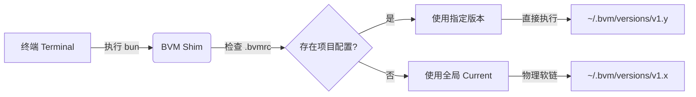

<div align="center">
  <h1>BVM</h1>
  <h3>Bun 原生版本管理器</h3>
  <p>
    0ms 极速启动 · 原子级隔离 · 全球 CDN 加速
  </p>

  [](https://github.com/EricLLLLLL/bvm/releases)
  [](#)
  [](#)
  [](#)
  <br/>
  <a href="./README.md">🇺🇸 English Docs</a>
</div>

<details>
  <summary><strong>文档目录 (Table of Contents)</strong></summary>

- [为什么选择 BVM?](#-为什么选择-bvm)
- [工作原理](#-工作原理)
- [性能跑分](#-性能跑分-benchmark)
- [安装指南](#-安装指南)
- [快速开始](#-快速开始)
- [项目级配置 (.bvmrc)](#-项目级配置-bvmrc)
- [迁移指南](#-从-nvm--fnm-迁移)
- [开源协议](#-license)

</details>

<br/>

**BVM** 是专为 Bun 打造的下一代版本管理器。**你可以把它看作是 Bun 生态中的 `nvm` 或 `fnm`，但速度更快、更智能。**

它利用 Bun 运行时自身的优势，提供了突破物理极限的安装与管理体验。不同于那些会拖慢终端启动速度或依赖笨重代理的旧时代工具，BVM 采用原生 OS 机制，实现了 **0ms 的 Shell 启动延迟**。

---

## 🧩 工作原理

BVM 采用 **软链接与 Shim 混合架构 (Symlink-Shim Hybrid)**，在保持完美隔离的同时实现了零延迟。



1.  **全局软链**: `bvm use` 更新 `~/.bvm/current` 物理软链接。你的 Shell `PATH` 直接指向此处，因此启动速度等同于原生。
2.  **智能 Shim**: 当你执行 `bun` 命令时，BVM 的轻量级 Shim 仅在**必要时**（如检测到 `.bvmrc`）介入，否则直接透传给底层二进制文件。
3.  **依赖注入**: BVM 动态注入 `BUN_INSTALL` 环境变量，确保 v1.0 安装的全局包绝对不会泄漏到 v1.1 环境中。

---

## 🌟 为什么选择 BVM？

### 🚀 0ms 极速启动 (Zero-Latency)
告别终端卡顿。BVM 采用 **Shim 架构** 配合 **物理软链接**。无论你是在打开新标签页还是切换项目，`bun` 命令都是瞬间可用的，没有像 `nvm` 那样的"Shell 初始化税"。

### ⚡ 全球极速下载 (自带镜像)
我们不依赖不稳定的 GitHub Releases。BVM 的所有资源都通过高性能 CDN 交付。
*   **源码交付**: 通过 **jsDelivr** (全球边缘网络) 秒级分发。
*   **Bun 二进制**: 直接从 **NPM** (Fastly/Cloudflare) 下载。
*   **智能镜像切换**: Bun 二进制文件直接从 **NPM** 官方分发路径下载。BVM 会根据你的网络环境自动选择最快镜像源（如 `npmmirror`），无需任何手动配置，全球范围内皆可实现极速下载。

### 🛡️ "地堡" 架构 (Bunker Architecture)
BVM 是**坚不可摧**的。它维护着一个私有、隔离的 Bun 运行时 (`~/.bvm/runtime`)。即使你删除了所有安装的 Bun 版本，或者搞乱了系统路径，BVM 依然能自我修复并正常工作。

### 📦 环境级原子隔离
切换版本不应导致全局工具崩溃。BVM 为每个版本注入独立的 `BUN_INSTALL` 路径。
*   Bun `v1.0.0` 的全局包只存在于 `v1.0.0` 中。
*   Bun `v1.1.0` 的全局包与之完全隔离。
*   彻底杜绝 "幽灵冲突" 和 CLI 报错。

### 🪟 原生 Windows 支持
Windows 用户不再是二等公民。BVM 专为 PowerShell 原生构建，提供与 macOS/Linux 完全一致的功能集和极速体验。

---

## ⚡ 性能跑分 (Benchmark)

基于 `scripts/benchmark-ultimate.ts` 实测数据 (M1 Pro, macOS)。

| 指标 | **BVM** (Bun) | **fnm / bum** (Rust) | **nvm** (Legacy) |
| :--- | :--- | :--- | :--- |
| **命令执行 (bun -v)** | **~19ms** ⚡️ | ~28ms | >200ms |
| **Shell 启动延迟** | **0ms** 🟢 | 0ms | ~500ms 🔴 |
| **架构机制** | **OS 原生软链** / 高性能 Shim | 二进制代理 | Shell 脚本 |
| **自身体积** | **~45KB** | ~5MB | ~100KB |
| **下载机制** | **NPM + 智能镜像** | GitHub Releases | 慢 / 手动配置 |

> **物理极限**: BVM 利用操作系统内核的软链接直接指向二进制文件（或通过极简 Shim 解析）。**它的速度等同于你直接运行 Bun，没有任何中间层开销。** 即使在解析 `.bvmrc` 的项目模式下，额外开销也仅为 ~8ms。

---

## 📥 安装指南

### macOS / Linux / WSL
脚本会自动检测系统与架构。

```bash
curl -fsSL https://cdn.jsdelivr.net/gh/EricLLLLLL/bvm@main/install.sh | bash
```

### Windows (PowerShell)
**无需**管理员权限。

```powershell
irm https://cdn.jsdelivr.net/gh/EricLLLLLL/bvm@main/install.ps1 | iex
```

---

## 🔄 从 nvm / fnm 迁移？

如果你习惯使用 Node Version Manager (nvm)，你会感到非常亲切。BVM 支持同样的核心工作流，但速度有了质的飞跃。

且不同于 `nvm` 经常需要手动配置镜像环境变量 (`NVM_NODEJS_ORG_MIRROR`) 才能在国内正常使用，BVM **开箱即用**，自动为你选择最快的源。

| 任务 | **nvm** (Node) | **BVM** (Bun) |
| :--- | :--- | :--- |
| 安装版本 | `nvm install 20` | `bvm install latest` |
| 切换版本 | `nvm use 20` | `bvm use latest` |
| 设为默认 | `nvm alias default 20` | `bvm default latest` |
| 列出版本 | `nvm ls` | `bvm ls` |

---

## 🎮 快速开始

**安装最新版**
```bash
bvm install latest
```

**切换到指定版本**
```bash
bvm use 1.0.1
```

**安装特定版本**
```bash
bvm install 1.0.1
```

**列出所有版本**
```bash
bvm ls          # 本地已安装
bvm ls-remote   # 远程可用
```

**设置默认版本 (新窗口生效)**
```bash
bvm default 1.0.1
```

**升级 BVM 自身**
```bash
bvm upgrade
```

---

## 📁 项目级配置 (.bvmrc)

BVM 支持针对每个项目自动切换版本，这是团队协作的必备功能。

1.  **创建配置文件**:
    在你的项目根目录下创建 `.bvmrc` 文件：
    ```bash
    echo "1.0.1" > .bvmrc
    ```
2.  **直接运行 Bun**:
    当你在该目录下运行任何 `bun` 命令时，BVM 会自动检测并使用配置的版本。
    ```bash
    cd my-project
    bun -v
    # 1.1.20 (自动解析自 .bvmrc)
    ```

    *无需手动执行 `bvm use`，一切自动发生。*

---


MIT © [EricLLLLLL](https://github.com/EricLLLLLL)
