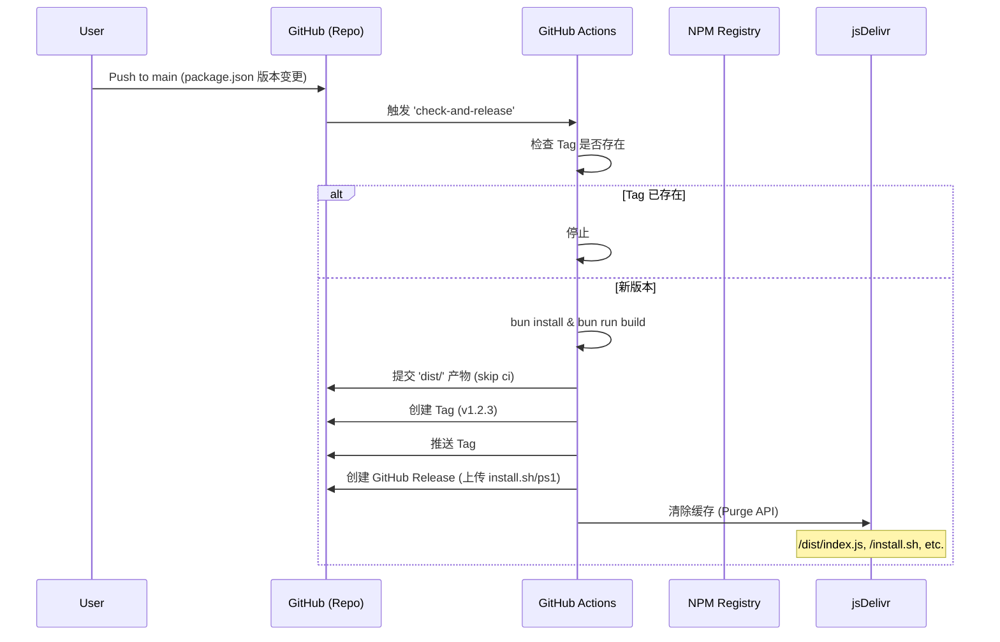

# BVM 架构与流程文档

> **定位**: 本文档是 BVM 内部架构、安装流程和发布机制的单一真实来源。它既设计为供 AI 代理阅读（作为 Knowledge Base），也供人类贡献者参考。

## 1. 安装逻辑 (`install.sh` & `install.ps1`)

BVM 采用“自引导（Bootstrap）”安装模式。安装脚本（Shell/PowerShell）负责环境的初始设置和运行时的下载，而不是分发一个打包好的二进制可执行文件。

### 1.1 Unix 安装流程 (`install.sh`)

```mermaid
graph TD
    Start(用户运行 install.sh) --> Registry{检查 npmmirror.com}
    Registry -- 可连接 --> Reg_CN[设置源: npmmirror]
    Registry -- 超时 --> Reg_Default[设置源: npmjs]
    
    Reg_CN --> ResolveVer[解析 Bun 版本]
    Reg_Default --> ResolveVer
    
    ResolveVer --> CheckRuntime{Runtime 已安装?}
    CheckRuntime -- 是 --> LinkCurrent[链接 runtime/current]
    CheckRuntime -- 否 --> DownloadRuntime[下载 bun-runtime.tgz]
    DownloadRuntime --> ExtractRuntime[解压至 versions/vX.Y.Z]
    ExtractRuntime --> LinkCurrent
    
    LinkCurrent --> DownloadBVM[下载 BVM 源码 (index.js)]
    DownloadBVM --> DownloadShim[下载 Shim 逻辑 (bvm-shim.sh)]
    DownloadShim --> CreateWrappers[创建 'bvm' 包装器 & Shims]
    
    CreateWrappers --> FirstInit[将 'default' 别名链接到当前版本]
    FirstInit --> RunSetup[运行 'bvm setup']
    
    RunSetup --> DetectShell[检测 Shell (zsh/bash/fish)]
    DetectShell --> ModProfile[修改 Profile (.zshrc/.bashrc/config.fish)]
    ModProfile --> End(安装完成)
```

**关键实现细节:**
*   **文件:** `install.sh`
*   **智能源选择:** 基于 `curl` 连接测试，自动在 `registry.npmjs.org` 和 `registry.npmmirror.com` 之间切换。
*   **运行时解析:** 从 Registry 获取 `dist-tags` 以确定兼容的最新 Bun 版本。
*   **无依赖:** 脚本仅依赖系统自带的 `curl` 和 `tar`。
*   **Shim 生成:** 静态生成 `bvm` (CLI 入口) 和 `bun/bunx` (Shims) 脚本文件，指向正确的路径。

### 1.2 Windows 安装流程 (`install.ps1`)

```mermaid
graph TD
    Start(用户运行 install.ps1) --> PreClean[清理旧 Shims]
    PreClean --> Registry{检查 npmmirror.com}
    Registry -- OK --> Reg_CN[设置源: npmmirror]
    Registry -- 失败 --> Reg_Default[设置源: npmjs]
    
    Reg_CN --> ResolveVer
    Reg_Default --> ResolveVer[解析 Bun 版本]
    
    ResolveVer --> CheckRuntime{Runtime 已安装?}
    CheckRuntime -- 否 --> DownloadRuntime[下载 bun-windows-x64.tgz]
    DownloadRuntime --> Extract[解压至 .bvm/versions/vX]
    Extract --> LinkRuntime[创建 Junction: runtime/current -> versions/vX]
    CheckRuntime -- 是 --> LinkRuntime
    
    LinkRuntime --> DownloadSrc[下载 dist/index.js & bvm-shim.js]
    DownloadSrc --> CreateShims[创建 .cmd Shims]
    
    CreateShims --> ModPath[更新用户 PATH 环境变量]
    ModPath --> RunSetup[运行 'bvm setup' (PowerShell Profile 更新)]
    RunSetup --> End(安装完成)
```

**关键实现细节:**
*   **文件:** `install.ps1`
*   **原生 Powershell:** 使用 `Invoke-WebRequest` 和 `Invoke-RestMethod`。
*   **Junctions:** 使用 Windows Junctions (`New-Item -ItemType Junction`) 代替软链接，以获得更好的兼容性且无需管理员权限。
*   **环境变量:** 直接修改 `[Environment]::SetEnvironmentVariable("Path", ...)` 以确保持久化。

---

## 2. 命令实现流程

BVM 使用一个轻量级的 Router 来分发命令。架构上将“CLI 入口”与“命令逻辑”分离。

### 2.1 CLI 架构

```mermaid
graph LR
    UserInput(bvm install 1.0.0) --> Router[src/index.ts: App.run()]
    Router --> ParseArgs[util.parseArgs]
    ParseArgs --> MatchCommand{匹配命令?}
    
    MatchCommand -- 是 --> ActionHandler[执行 Action]
    MatchCommand -- 否 --> ShowHelp[显示帮助]
    
    ActionHandler --> CommandFunc[例如: commands/install.ts: installBunVersion]
    CommandFunc --> Utils[工具库: npm-lookup, ui, etc.]
    
    subgraph Execution Context
    Utils --> BunRuntime[Bun Runtime (Current)]
    end
```

### 2.2 命令映射表

| 命令 | 文件路径 | 描述 |
| :--- | :--- | :--- |
| `install` | `src/commands/install.ts` | 从 NPM Registry 下载并解压 Bun 版本。 |
| `use` | `src/commands/use.ts` | 更新 `~/.bvm/runtime/current` 软链接。 |
| `ls-remote` | `src/commands/ls-remote.ts` | 从 NPM Registry 获取可用版本 (`npm view`)。 |
| `alias` | `src/commands/alias.ts` | 在 `~/.bvm/aliases/` 中创建命名软链接。 |
| `setup` | `src/commands/setup.ts` | 检测 Shell 并修改 `.rc` 文件或 PowerShell Profile。 |
| `upgrade` | `src/commands/upgrade.ts` | 从 CDN 重新下载最新的 BVM 源代码。 |

---

## 3. 测试策略与环境

BVM 采用双层测试策略，确保内部逻辑正确性和端到端（E2E）的可靠性。

### 3.1 测试金字塔


### 3.2 测试规范

| 级别 | 范围 | 工具 | 位置 | 环境要求 |
| :--- | :--- | :--- | :--- | :--- |
| **Unit** | 内部逻辑 (`semver`, `npm-lookup`, `utils`) | `bun:test` | `test/*.test.ts` | 已安装 `bun`。 |
| **E2E** | 完整 CLI 工作流, 文件系统, Shell 配置 | `execa`, `bun:test` | `test/e2e/*.test.ts` | `bun`, `pwsh` (用于在 macOS/Linux 上测试 Windows 逻辑)。 |

### 3.3 CI 集成 (`.github/workflows/ci.yml`)

每次 Push 或 PR 到 `main` 分支时自动运行测试。
*   **矩阵:** `ubuntu-latest`, `macos-latest`, `windows-latest`。
*   **命令:** `bun test test/e2e` (环境变量 `CI=true`)。

---

## 4. 发布流程与集成

发布流程通过 GitHub Actions 完全自动化，确保安装脚本始终指向有效的 Artifacts。

### 4.1 发布流水线 (`auto-release.yml`)



### 4.2 产物耦合

*   **安装脚本源:** `install.sh` 和 `install.ps1` 从 `cdn.jsdelivr.net` 下载 `index.js` 和 `bvm-shim.sh`。
*   **版本控制:** URL 中包含版本 Tag: `.../gh/EricLLLLLL/bvm@v1.0.6/dist/index.js`。
*   **自更新:** `bvm upgrade` 命令通过 GitHub API 获取 `latest` Tag 来确定新版本，然后下载新的源代码。

---

## 5. 全球加速与镜像方法论

BVM 旨在实现全球范围内的“0ms 延迟”和“高可用性”。

### 5.1 架构


### 5.2 实施规则

1.  **动态检测:** `install.sh` 和 `src/utils/npm-lookup.ts` 都会对 `registry.npmmirror.com` 执行运行时检查（HEAD 请求或 curl）。
    *   如果延迟 < 阈值（或成功返回 200 OK），则切换 `REGISTRY` 变量。
2.  **资源托管:** BVM 不维护自己的后端。所有二进制文件均来源：
    *   **BVM 逻辑:** GitHub Repo -> jsDelivr CDN。
    *   **Bun Runtimes:** 官方 NPM 包 (`@oven/bun-...`) -> NPM Registry / Mirror。
3.  **零配置:** 用户无需手动设置 `BVM_MIRROR`。系统“默认智能”。