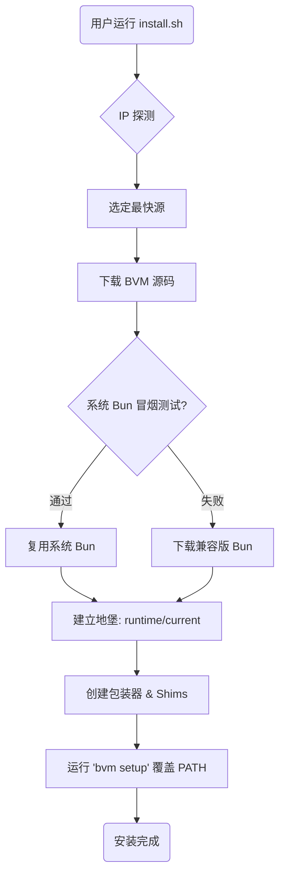
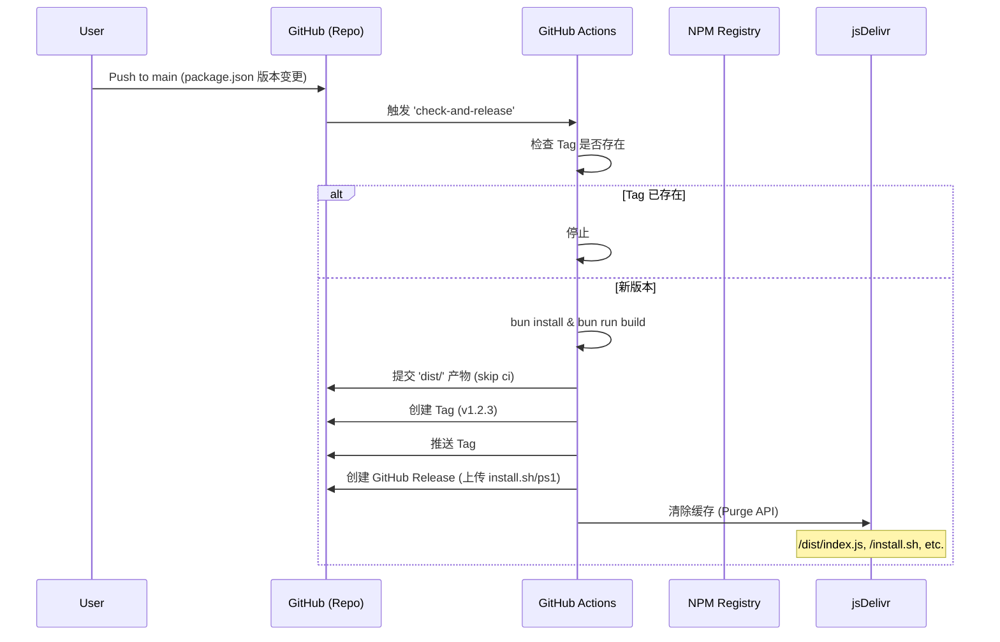
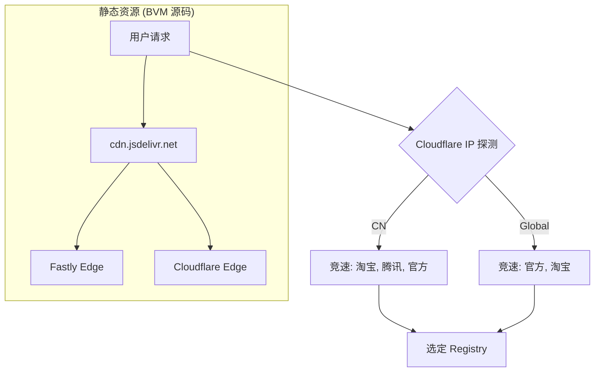

# BVM 架构与流程文档

> **定位**: 本文档是 BVM 内部架构、安装流程和发布机制的单一真实来源。它既设计为供 AI 代理阅读（作为 Knowledge Base），也供人类贡献者参考。

## 1. 安装逻辑 (`install.sh`, `install.ps1`, `postinstall.js`)

BVM 采用“自引导（Bootstrap）”安装模式，并引入了“地堡架构 (Bunker Architecture)”：BVM 拥有自己专用的、隔离的 Bun 运行时，不依赖于用户当前正在使用的 Bun 版本。

### 1.1 标准安装流水线 (所有脚本通用)

无论通过何种方式安装，BVM 都遵循以下标准流程：

1.  **资产部署**: 下载并提取 BVM 核心源码 (`index.js`) 和 Shims。
2.  **系统 Bun 探测**: 检查系统 `PATH` 中是否已有 `bun` 可执行文件。
3.  **冒烟测试 (Smoke Test)**:
    *   若存在系统 Bun，尝试运行 `bun index.js --version`。
    *   **通过**: 说明该 Bun 兼容，可直接复用。
    *   **失败**: 说明该 Bun 无法驱动 BVM（版本过旧或不兼容）。
4.  **运行时配置**:
    *   **复用模式**: 若通过测试，将系统 Bun 注册到 `versions/vX.Y.Z`。
    *   **下载模式**: 若未通过测试或无系统 Bun，下载官方推荐的稳定版并安装到 `versions/vLatest`。
5.  **地堡激活 (Bunker Setup)**:
    *   设置 `runtime/current` 指向选定的 Bun 版本（私有运行时）。
    *   设置 `current` 软链接指向该版本（初始用户版本）。
    *   设置 `default` 别名。
6.  **环境对齐**: 运行 `bvm setup` 将 BVM 路径追加到用户 Profile **末尾**，确保 BVM 优先级最高。

### 1.2 NPM 全局安装 (`postinstall.js`)

当用户运行 `npm install -g bvm-core` 时触发。

*   **品牌化输出**: 显示 ASCII Logo 和安装进度。
*   **自检逻辑**: 自动执行上述 1.1 的流程。
*   **零配置使用**: 安装后自动提示 `source ~/.zshrc` 以立即生效。

### 1.3 Unix 安装流程 (`install.sh`)



### 1.4 Windows 安装流程 (`install.ps1`)

```mermaid
graph TD
    Start(用户运行 install.ps1) --> PreClean[清理旧 Shims]
    PreClean --> DownloadSrc[下载 BVM 核心资产]
    DownloadSrc --> SmokeTest{系统 Bun 兼容性测试?}
    
    SmokeTest -- 成功 --> Reuse[复用系统 Bun (Junction)]
    SmokeTest -- 失败 --> DownloadBun[下载 Windows 版 Bun]
    
    Reuse --> LinkBunker[建立地堡: runtime/current]
    DownloadBun --> LinkBunker
    
    LinkBunker --> CreateShims[创建 .cmd Shims]
    CreateShims --> ModPath[更新用户 PATH (末尾追加)]
    ModPath --> RunSetup[Profile 对齐]
    RunSetup --> End(安装完成)
```

**关键架构变更:**
*   **版本前缀**: 强制使用 `vX.Y.Z` 格式（如 `v1.3.6`）。
*   **双重链接**: 
    *   `~/.bvm/runtime/current` -> 私有宿主 (Private Host)。
    *   `~/.bvm/current` -> 用户当前活跃版本 (Active Version)。
*   **隔离性**: BVM 自身的命令现在优先使用 `runtime/current` 运行，实现了管理器与被管理版本的完全解耦。

---

## 2. 命令实现流程

BVM 使用一个轻量级的 Router 来分发命令。架构上将“CLI 入口”与“命令逻辑”分离。

### 2.1 CLI 架构

```mermaid
graph LR
    UserInput(bvm install 1.0.0) --> Router[src/index.ts: App.run()]
    Router --> ParseArgs[util.parseArgs]
    ParseArgs --> MatchCommand{匹配命令?}
    
    MatchCommand -- 是 --> ActionHandler[执行 Action]
    MatchCommand -- 否 --> ShowHelp[显示帮助]
    
    ActionHandler --> CommandFunc[例如: commands/install.ts: installBunVersion]
    CommandFunc --> Utils[工具库: npm-lookup, ui, etc.]
    
    subgraph Execution Context
    Utils --> BunRuntime[Bun Runtime (Current)]
    end
```

### 2.2 命令映射表

| 命令 | 文件路径 | 描述 |
| :--- | :--- | :--- |
| `install` | `src/commands/install.ts` | 从 NPM Registry 下载并解压 Bun 版本。 |
| `use` | `src/commands/use.ts` | 更新 `~/.bvm/runtime/current` 软链接。 |
| `ls-remote` | `src/commands/ls-remote.ts` | 从 NPM Registry 获取可用版本 (`npm view`)。 |
| `alias` | `src/commands/alias.ts` | 在 `~/.bvm/aliases/` 中创建命名软链接。 |
| `setup` | `src/commands/setup.ts` | 检测 Shell 并修改 `.rc` 文件或 PowerShell Profile。 |
| `upgrade` | `src/commands/upgrade.ts` | 从 CDN 重新下载最新的 BVM 源代码。 |

---

## 3. 测试策略与环境

BVM 采用双层测试策略，确保内部逻辑正确性和端到端（E2E）的可靠性。

### 3.1 测试金字塔


### 3.2 测试规范

| 级别 | 范围 | 工具 | 位置 | 环境要求 |
| :--- | :--- | :--- | :--- | :--- |
| **Unit** | 内部逻辑 (`semver`, `npm-lookup`, `utils`) | `bun:test` | `test/*.test.ts` | 已安装 `bun`。 |
| **E2E** | 完整 CLI 工作流, 文件系统, Shell 配置 | `execa`, `bun:test` | `test/e2e/*.test.ts` | `bun`, `pwsh` (用于在 macOS/Linux 上测试 Windows 逻辑)。 |

### 3.3 CI 集成 (`.github/workflows/ci.yml`)

每次 Push 或 PR 到 `main` 分支时自动运行测试。
*   **矩阵:** `ubuntu-latest`, `macos-latest`, `windows-latest`。
*   **命令:** `bun test test/e2e` (环境变量 `CI=true`)。

---

## 4. 发布流程与集成

发布流程通过 GitHub Actions 完全自动化，确保安装脚本始终指向有效的 Artifacts。

### 4.1 发布流水线 (`auto-release.yml`)



### 4.2 产物耦合

*   **安装脚本源:** `install.sh` 和 `install.ps1` 从 `cdn.jsdelivr.net` 下载 `index.js` 和 `bvm-shim.sh`。
*   **版本控制:** URL 中包含版本 Tag: `.../gh/EricLLLLLL/bvm@v1.0.6/dist/index.js`。
*   **自更新:** `bvm upgrade` 命令通过 GitHub API 获取 `latest` Tag 来确定新版本，然后下载新的源代码。

---

## 5. 全球加速与镜像方法论

BVM 旨在实现全球范围内的“0ms 延迟”和“高可用性”。

### 5.1 架构



### 5.2 实施规则

1.  **Geo-Location (IP 探测):** 访问 `https://1.1.1.1/cdn-cgi/trace` 获取用户地理位置 (`loc=CN`)。设置 500ms 超时，快速失败。
2.  **Race Strategy (竞速策略):** 对候选源（npmmirror, tencent, npmjs）并发发起 `HEAD` 请求，选用响应最快的源。
3.  **资源托管:** BVM 不维护自己的后端。所有二进制文件均来源：
    *   **BVM 逻辑:** GitHub Repo -> jsDelivr CDN。
    *   **Bun Runtimes:** 官方 NPM 包 (`@oven/bun-...`) -> 智能选定的 Registry。
4.  **零配置:** 用户无需手动设置 `BVM_MIRROR`。系统“默认智能”。

---

## 6. 已知限制与技术债 (Known Issues)

### 6.1 Shim 性能与实现
*   **现状:** Windows Shim (`bun.cmd`) 和 Unix Shim (`bun`) 目前调用 `bvm-shim.js` 来处理逻辑。这意味着每次运行 `bun` 命令都需要启动一次 Bun JS 运行时。
*   **影响:** 相比于原生二进制（Native）或纯 Batch/Shell 实现，存在一定的启动延迟。
*   **计划:** 未来考虑迁移到 Rust/Go 编写的 Native Shim 或纯 CMD/Bash 实现以追求极致性能。

### 6.2 Upgrade 命令局限性
*   **现状:** `bvm upgrade` 目前仅更新 `dist/index.js` (CLI 核心逻辑)。
*   **问题:** 它**不会**更新 `bvm-shim.js` 或 Shim 包装器脚本。如果 Shim 逻辑发生变更，用户升级后可能遇到不兼容问题。
*   **规避:** 建议用户在遇到奇怪问题时，重新运行安装脚本进行“覆盖安装”以更新所有组件。